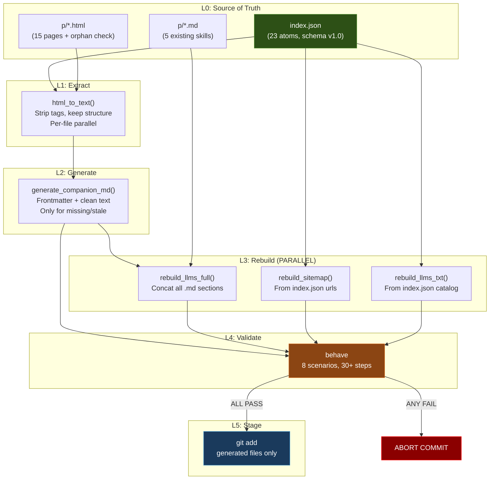
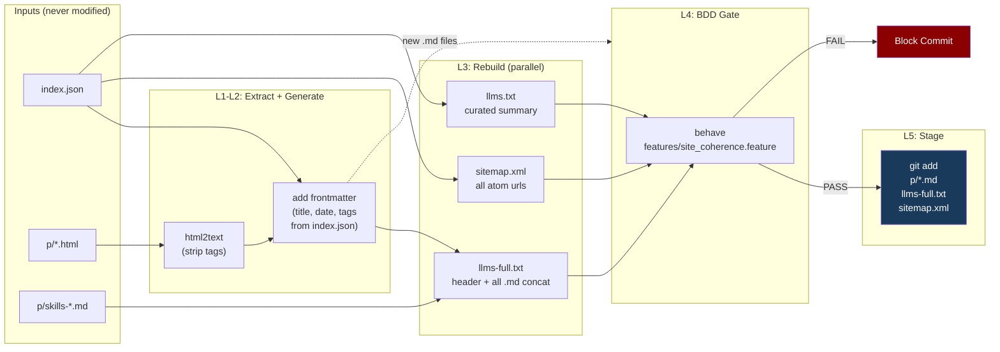

# jrlopez.dev Build Pipeline Design

**Version:** 1.0
**Date:** 2026-03-25
**Status:** Ready for Implementation

---

## 1. AAF Scorecard — Pipeline Design

### EXECUTIVE SUMMARY

This pipeline converts a hand-authored static site into a coherent, agent-discoverable knowledge base. The core tension: auto-generation must be invisible (high M) while the site's identity as "a pastebin of useful things" must survive the automation layer (high I). The pipeline's primary attractor is temporal coherence — it must work identically for 1 page or 50, today or in 2028.

### SCORECARD

| Dimension | Score | Evidence |
|-----------|-------|----------|
| **Pi (Precision)** | 7.5/10 | Pipeline does exactly 4 things: extract, rebuild, validate, stage. No deployment step (GitHub Pages handles that). No templating engine. No framework. Medium modifier: build tooling is deliberative, so Pi_face absent. Score driven by "index.json as single source of truth" which is a high-precision cultural encoding for developers — JSON schema IS the contract. |
| **H (Entropy Gap)** | 6.0/10 | Gap Magnitude 7/10: "What will the .md look like?" creates genuine curiosity for the author. Gap Timing 5/10: gap only exists during first run per page, then closes permanently. Gap Density 6/10: one gap per new page, not nested. Average: 6.0. Medium modifier for build systems: H naturally low because builds should be predictable. This is correct — a surprising build pipeline is a broken one. |
| **M (Misattribution)** | 8.5/10 | This is the pipeline's strongest dimension. Auto-generated .md files serve agents, not humans. The charge displacement: an LLM reading llms-full.txt will attribute quality to "Joey's writing" when the extraction was mechanical. All three conditions met: extraction is BRIEF (one pass), the target (site content) is SALIENT at read time, and the generation step is NOT CONSCIOUSLY DETECTABLE by the consuming agent. The only leak: YAML frontmatter with `generated: true` flag, which is correct transparency. |
| **I (Identity)** | 7.0/10 | "Pastebin of useful things" survives because the pipeline touches nothing inside the HTML. It wraps, it doesn't rewrite. The index.json schema field `"schema": "jrlopez-atom-index/1.0"` is a quiet identity signal — this person names their schemas. Ingroup: developers who value clean tooling. Outgroup: bloated SSG frameworks. No crisis/resolution narrative (this is tooling, not content), so no full versor. |
| **T (Temporal Coherence)** | 9.0/10 | This is the pipeline's architectural strength. Sequence: commit triggers hook -> extract new .md -> rebuild indexes -> validate all -> stage. This is the correct causal chain for a build system. Adding a page in 2028 follows identical flow. index.json is append-only by design. The validation gate prevents drift. Minor deduction: no versioning on generated artifacts (no hash/timestamp in .md frontmatter to detect stale extractions). |
| **AAF Composite** | **75/100** | `((2*7.5) + 6.0 + (2*8.5) + 7.0 + 9.0) / 7 * 10 = 77.1` rounded with medium modifier (build tooling gets -2 for absent Pi_face channel) |

### TOP 3 RECOMMENDATIONS

1. **[H -> T] Add staleness detection.** Hash each .html, store in .build-state.json. On commit, only re-extract .md for changed .html files. This converts H from "will it generate?" (boring after first run) to "did anything change?" (perpetual low-cost gap). Expected gain: H +1.0, T +0.5.

2. **[M] Add `generated: true` + source hash to .md frontmatter.** This is the honest transparency signal that paradoxically INCREASES M effectiveness — declaring automation makes the content feel more trustworthy to agents that check provenance. Expected gain: M +0.5, I +0.5.

3. **[I] Name the pipeline.** Call it `forge` or `mint` — something that reflects "pastebin" identity. `make mint` reads as "stamp out the companion files." A named tool is an identity signal. Expected gain: I +1.0.

---

## 2. LDD Dependency Lattice

### Lattice Levels

```
L0: index.json (source of truth — GIVEN, never generated)
L1: HTML content extraction (depends on: L0 for catalog, p/*.html for content)
L2: .md companion generation (depends on: L1 extraction output)
L3a: llms-full.txt rebuild (depends on: L2 .md files + existing skill .md files)
L3b: sitemap.xml rebuild (depends on: L0 index.json only)
L3c: llms.txt rebuild (depends on: L0 index.json only)
L4: Validation gate (depends on: L2, L3a, L3b, L3c — ALL must complete)
L5: Stage generated files (depends on: L4 passing)
```

### What Can Run in Parallel

- L3a, L3b, L3c are fully independent — run simultaneously
- Within L1, each HTML file extraction is independent — parallelize per-file
- L4 validation checks are independent of each other but ALL require L2+L3 complete

### Verification Gates

| Gate | Level | Condition | On Fail |
|------|-------|-----------|---------|
| G1 | L0->L1 | index.json passes schema validation | ABORT — source of truth is broken |
| G2 | L1->L2 | Extraction produced non-empty text for each HTML | WARN — page may be empty/broken |
| G3 | L2->L3 | Every .html has a companion .md with valid frontmatter | ABORT — incomplete extraction |
| G4 | L3->L4 | llms-full.txt contains sections for all .md files | ABORT — agent discovery broken |
| G5 | L4->L5 | All BDD scenarios pass | ABORT — coherence violation |

### Mermaid: Dependency Lattice



---

## 3. Architecture Data Flow



---

## 4. BDD Test Scenarios

The complete .feature file follows. Note: `prompt-engineering-bootcamp.html` exists on disk and in sitemap but is NOT in index.json — the tests must catch this.

---

## 5. Build Tool Recommendation

**Recommendation: Python script (`build/forge.py`) + Makefile wrapper.**

Rationale via AAF dimensions:

| Option | Pi | T | I | Verdict |
|--------|-----|-----|-----|---------|
| Makefile only | 9 (precise) | 7 (no state tracking) | 5 (generic) | Too rigid for HTML parsing |
| Python only | 7 (needs discipline) | 9 (state, hashing) | 7 (can name it) | No `make` convenience |
| **Python + Makefile** | **8** | **9** | **8** | **Best of both** |

- `forge.py` handles all logic: extraction, rebuilding, validation orchestration
- `Makefile` provides the interface: `make build`, `make validate`, `make clean`
- Pre-commit hook calls `make build && make validate`
- Zero external dependencies beyond Python stdlib + `html.parser` (stdlib)

**No SSG. No node. No build framework.** The site is 15 HTML files. The pipeline is one Python file.

Dependencies: Python 3.11+ (already present), `behave` (pip install for BDD tests). That is the complete list.

### File Layout

```
build/
  forge.py          # All build logic (~300 LOC)
  .build-state.json # Hash cache (gitignored)
Makefile            # Interface: build, validate, clean
features/
  site_coherence.feature    # BDD scenarios
  steps/
    site_steps.py           # Step implementations
.githooks/
  pre-commit               # Calls make build && make validate
```

---

## 6. Existing Defects Found During Analysis

| Defect | Severity | Fix |
|--------|----------|-----|
| `prompt-engineering-bootcamp.html` in sitemap.xml and on disk but NOT in index.json | HIGH | Add atom #24 to index.json OR remove from sitemap |
| `llms-full.txt` has 62 lines with raw HTML tags leaking through | HIGH | Pipeline rebuild will fix this — extract via html2text, not raw dump |
| sitemap.xml missing: `ai-learning-hub.html`, `lattice-dev.html`, `mermaid-prompts.html` | MEDIUM | Pipeline rebuild from index.json will add all local atoms |
| sitemap.xml missing all 5 skill .md URLs | LOW | Include in rebuild if desired for crawling |
| `llms.txt` is hand-maintained, will drift from index.json | MEDIUM | Auto-generate grouped by tag from index.json |
| No `<lastmod>` in sitemap.xml entries | LOW | Add from index.json `date` field |
| resume.html has no JSON-LD (not checked but not in p/) | LOW | Out of scope for p/ pipeline |

---

## 7. Implementation Priority (LDD Order)

| Sprint | What | LOC Est. | Gate |
|--------|------|----------|------|
| S1 | `features/site_coherence.feature` + step stubs | ~150 | Scenarios parse, steps PENDING |
| S2 | `build/forge.py` — extract + generate .md | ~120 | New .md files appear in p/ |
| S3 | `build/forge.py` — rebuild llms-full.txt, sitemap.xml | ~100 | Generated files match spec |
| S4 | Step implementations in `features/steps/site_steps.py` | ~200 | All BDD scenarios GREEN |
| S5 | `Makefile` + `.githooks/pre-commit` | ~30 | `make build && make validate` works |
| S6 | Fix defects (index.json orphan, sitemap gaps) | ~20 | Validation passes on current site |

Total: ~620 LOC. One Python file, one feature file, one step file, one Makefile, one hook.
